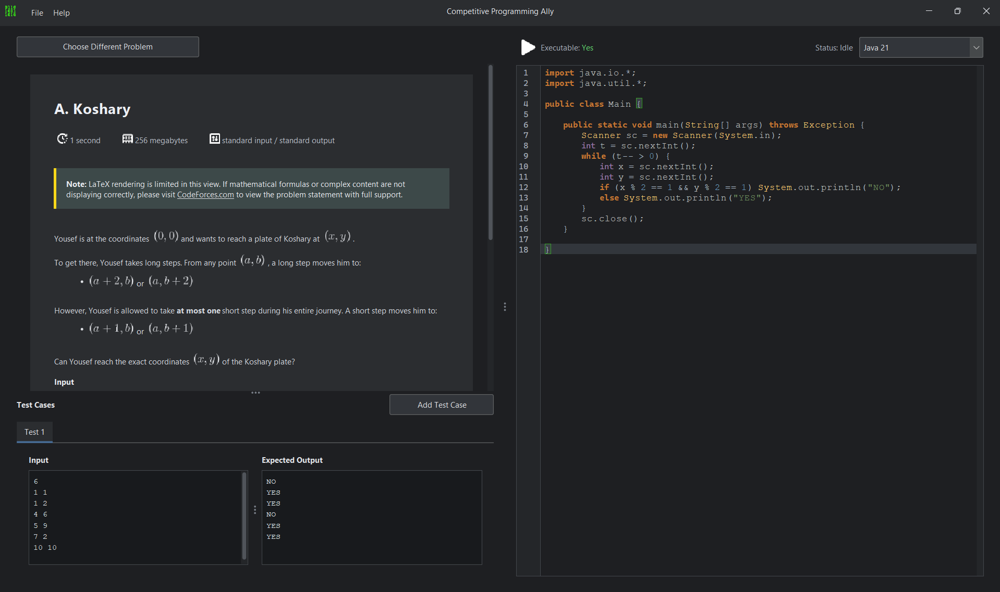

    

<h1 align="center" style="text-align: center; font-size: 35px; font-weight: 700;">CP Ally IDE</h1>

Unofficial partner code editor for competitive programming, in CodeForces.

> [!IMPORTANT]
> This application is currently in beta. It is prone to bugs and crashes.

## Table of Contents
- [Why CP Ally IDE?](#why-cp-ally-ide)
- [List of Features](#list-of-features)
- [Contributing](#contributing)
- [License](#license)
- [List of Contributors](#list-of-contributors)

## Why CP Ally IDE?
CP Ally IDE is built for competitive programming workflows where speed matters more than general-purpose IDE features. It combines problem fetching, local execution, cached problem content, and a code editor in one window so you can move from a problem code to a working solution without switching tools.

Use it when you want to:
- open a Codeforces problem directly from its contest code, such as `2208A`
- keep the problem statement and test cases visible while editing code
- run solutions locally against sample and custom test cases
- reuse cached problem statements and source code when you return to the same task

The application is intentionally focused on the parts of competitive programming that cost time during a contest or practice session: fetching the statement, reading samples, editing quickly, testing locally, and keeping your work available when you revisit a problem.

## List of Features

### Problem fetching and viewing
- Fetches Codeforces problems by contest code and index, for example `2208A`.
- Supports Enter-to-fetch from the problem code input field.
- Displays the fetched problem statement in the left panel and keeps the editor visible on the right.
- Renders problem content with HTML, icons, and LaTeX support.
- Includes a statement-only view and a full view with sample tests.

### Local editing and execution
- Uses a syntax-highlighted code editor for writing solutions.
- Supports common competitive programming languages through the language dropdown.
- Preserves code when switching between problems or languages using programming cache.
- Runs the current solution locally against available test cases.

### Test case handling
- Shows Codeforces sample tests extracted from the statement.
- Supports custom test cases for manual checking.
- Handles `YES`/`NO` judging case-insensitively when the expected output only contains those tokens.
- Displays execution feedback and notes directly in the result output.

### Caching
- Caches fetched problem statements so previously opened problems load faster.
- Caches user code by problem code and language so solution work is restored when you return to a problem.
- Includes menu actions to clear problem cache or programming cache when you want a fresh start.

### Interface and usability
- Uses a dark Swing-based interface with a compact contest-friendly layout.
- Includes a splash screen on startup.
- Provides a help menu with release and project information.
- Persists window state, divider positions, and the last selected language.

### Supported workflow
1. Enter a Codeforces problem code such as `2208A`.
2. Press Enter or click `Fetch from CodeForces`.
3. Read the statement and sample tests in the left panel.
4. Select a language and write the solution in the editor.
5. Add or review custom test cases if needed.
6. Run the solution locally and inspect the result output.

## Contributing
Contributions should keep the app focused on fast competitive programming workflows. If you submit changes, keep the UI practical, avoid adding unrelated general-purpose IDE features, and preserve the current behavior of problem fetching, local execution, caching, and rendering.

Recommended contribution flow:
1. Fork the repository and create a feature branch.
2. Make a small, focused change.
3. Build the project locally with Maven and verify the app still starts.
4. If the change affects UI or rendering, test the affected path in the app.
5. Open a pull request with a clear description of what changed and why.

When contributing code, keep these expectations in mind:
- Preserve existing contest-focused shortcuts and flows.
- Avoid introducing breaking changes to cache files unless migration is handled.
- Prefer targeted fixes over broad refactors.
- Update the README if the change affects setup or user-facing behavior.

## License
This project is licensed under the Apache License 2.0.

You may use, modify, and redistribute the code under the terms of that license. If you distribute a modified version, keep the required license notices and attribution intact.

The full license text is available in the repository’s [LICENSE](LICENSE) file.

## List of Contributors
- [Swastik Biswas (Owner)](https://github.com/0xPolybit)
- [Himanshi Saxena](https://github.com/Hima-11-works)

If you contribute to the project, add your name here in a future update once your contribution is merged.