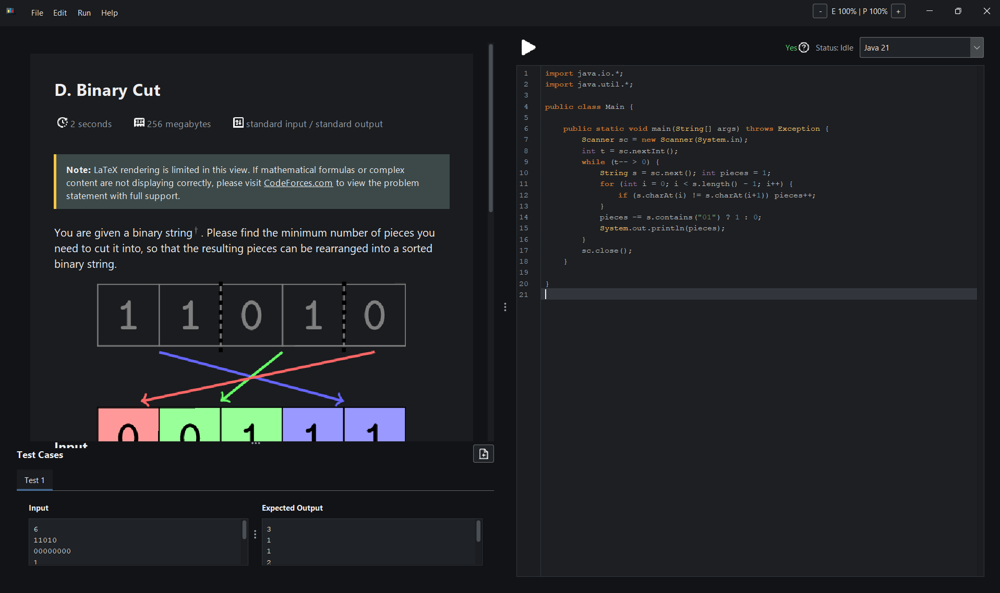

<p align="center">
  
</p>

<h1 align="center">CP Ally IDE</h1>

<p align="center">
  A focused code editor for competitive programming on Codeforces — fetch problems, write solutions, and test locally, all in one window.
</p>

<p align="center">
  <a href="https://github.com/0xPolybit/cp-ally-ide/releases"></a>
  <a href="https://www.oracle.com/java/technologies/javase/jdk17-archive-downloads.html"></a>
  <a href="LICENSE"></a>
  <a href="https://github.com/0xPolybit/cp-ally-ide/releases"></a>
  <a href="https://github.com/0xPolybit/cp-ally-ide/issues"></a>
  <a href="https://github.com/0xPolybit/cp-ally-ide/stargazers"></a>
</p>

> [!IMPORTANT]
> CP Ally IDE is currently in beta. Expect occasional bugs and rough edges.

---

## Table of Contents

- [Why CP Ally IDE?](#why-cp-ally-ide)
- [Demo](#demo)
- [Features](#features)
- [Installation](#installation)
  - [Windows Installer](#windows-installer-recommended)
  - [Run the JAR Directly](#run-the-jar-directly)
- [Building from Source](#building-from-source)
- [Deep Link Protocol](#deep-link-protocol)
- [Keyboard Shortcuts](#keyboard-shortcuts)
- [Contributing](#contributing)
- [License](#license)
- [Contributors](#contributors)

---

## Why CP Ally IDE?

Most IDE setups for competitive programming require switching between a browser for the problem statement, a text editor for code, and a terminal for testing. CP Ally IDE puts all three in a single window so you can stay focused on the problem.

It is built specifically for Codeforces workflows: type a problem code, read the statement, write a solution, and run it against the sample tests — without touching a browser or a separate terminal.

---

## Demo

[](https://www.youtube.com/watch?v=-CCY-HImmHk)

<p align="center"><em>Click the image above to watch the demo video (v0.1.3 beta).</em></p>

---

## Features

### Problem Fetching
- Fetch any Codeforces problem by its contest code and index (e.g. `2208A`).
- Renders the full problem statement with HTML, inline icons, and LaTeX math.
- Shows a statement-only view alongside a full view that includes sample test cases.
- Detects and discards bot-check pages — re-fetches automatically when the cached page is invalid.
- One-click **Refresh Problem** to re-fetch without clearing your editor.
- Recent-problem history with browser links and source-copy/submit-page workflow.
- GitHub Releases update checks run in the background without blocking startup.

### Deep Link Protocol
- Open problems from anywhere with `cpally://problem/2208A` links.
- If the app is already running, the link is forwarded to it instantly — no second window opens.
- If the app is closed, it starts and loads the problem automatically.
- Registered by the Windows installer; removed cleanly on uninstall.

### Practice Sheet Discovery
- When a problem is loaded, the app automatically checks the CP Ally practice sheet index.
- If the problem belongs to any sheets, they are listed at the bottom of the problem statement as clickable links.

### Code Editor
- Syntax-highlighted editor powered by RSyntaxTextArea.
- Supports C++, Java, Python 3, and other common languages via a language dropdown.
- Bracket auto-pairing with selection-wrapping support.
- Independent zoom control for the editor and the problem pane.
- Autosave with configurable interval.

### Test Cases
- Extracts sample test cases from the problem statement automatically.
- Add custom test cases with your own input and expected output (`Ctrl+Shift+T`).
- Edit, duplicate, copy, import, export, and run individual custom tests.
- `YES`/`NO` outputs are judged case-insensitively.
- Configurable execution timeout and output-size limits.
- Displays execution time, memory usage, and detailed comparison results.

### Caching
- Problem statements are cached locally — previously opened problems load instantly.
- Source code is cached per problem code and language — your work is restored when you return.
- Separate menu actions to clear the problem cache or the code cache.

### Interface
- Multiple themes: **Dark**, **Ultra Dark**, and **Light**, switchable from Preferences.
- Persistent window state: size, divider positions, last-used language, and zoom levels.
- Splash screen closes as soon as essential startup completes.
- Keyboard-accessible controls with global Find, Replace, Go to Line, Run, and zoom shortcuts.
- Credits and Diagnostics are available from the Help menu.
- Diagnostic log written to `%APPDATA%\CompetitiveProgrammingAlly\diagnostics.log`.

---

## Installation

### Windows Installer (Recommended)

1. Go to the [Releases page](https://github.com/0xPolybit/cp-ally-ide/releases).
2. Download `mysetup.exe` from the latest release.
3. Run the installer and follow the prompts.
4. The app is added to the Start Menu and optionally to the Desktop.
5. The `cpally://` URL protocol is registered automatically.

**Minimum requirement:** Windows 10 or later. A Java runtime is bundled — you do not need to install Java separately.

### Run the JAR Directly

If you have Java 17 or later installed:

```bash
java -jar cp-ally-ide-0.2.2.jar
```

Download the JAR from the [Releases page](https://github.com/0xPolybit/cp-ally-ide/releases). The `cpally://` protocol handler is not set up automatically when running the JAR directly.

---

## Building from Source

**Prerequisites**

| Tool | Version |
|------|---------|
| Java JDK | 17 or later |
| Maven | 3.8 or later |

**Steps**

```bash
# Clone the repository
git clone https://github.com/0xPolybit/cp-ally-ide.git
cd cp-ally-ide

# Build the fat JAR (includes all dependencies)
mvn package

# Run directly
java -jar target/cp-ally-ide-0.2.2.jar
```

The build produces a single self-contained JAR at `target/cp-ally-ide-0.2.2.jar`.

**Packaging for Windows**

To produce a distributable Windows installer:
1. Wrap the JAR with [Launch4j](https://launch4j.sourceforge.net/) to create an EXE.
2. Build the installer with [Inno Setup](https://jrsoftware.org/isinfo.php) using the `.iss` script in the project.

The Inno Setup script handles bundling the JRE, registering the `cpally://` URL protocol, and creating Start Menu/Desktop shortcuts.

---

## Deep Link Protocol

CP Ally IDE registers the `cpally://` URL scheme on installation. Use it to open problems directly from any browser, markdown file, or launcher.

**URL format**

```
cpally://problem/<code>
```

**Examples**

```
cpally://problem/1A
cpally://problem/2208A
cpally://problem/1900F
```

**How it works**

| Scenario | Behaviour |
|----------|-----------|
| App is closed | Launches the app, shows splash, then loads the problem |
| App is running | Forwards the URL to the running instance; no second window opens |
| App is minimized | Restores and brings the window to front, then loads the problem |

You can also trigger a link from the command line:

```bat
start cpally://problem/2208A
```

---

## Keyboard Shortcuts

| Action | Shortcut |
|--------|----------|
| Choose Problem | `Ctrl+N` |
| Open Empty Editor | `Ctrl+E` |
| Run Code | `Ctrl+R` |
| Preferences | `Ctrl+P` |
| Add Test Case | `Ctrl+Shift+T` |
| Zoom In | `Ctrl+=` |
| Zoom Out | `Ctrl+-` |
| Reset Zoom | `Ctrl+0` |
| Find | `Ctrl+F` |
| Replace | `Ctrl+H` |
| Go to Line | `Ctrl+G` |

---

## Contributing

Contributions are welcome. Keep changes focused on the competitive programming workflow — fast problem fetching, local execution, and a minimal interface.

**Guidelines**

- Keep the UI practical and contest-friendly.
- Do not introduce breaking changes to the cache file format without handling migration.
- Prefer targeted, small changes over broad refactors.
- If the change affects UI layout or rendering, test it in the running app.
- Update this README if the change affects setup or user-facing behavior.

**Workflow**

1. Fork the repository and create a feature branch from `main`.
2. Make your change and build locally with `mvn package`.
3. Verify the app starts and the affected feature works.
4. Open a pull request with a clear description of what changed and why.

**Reporting bugs**

Open an issue at [github.com/0xPolybit/cp-ally-ide/issues](https://github.com/0xPolybit/cp-ally-ide/issues). Include the problem code you were using (if relevant), the contents of `%APPDATA%\CompetitiveProgrammingAlly\diagnostics.log`, and a description of what you expected vs. what happened.

---

## License

Licensed under the [Apache License 2.0](LICENSE).

You may use, modify, and redistribute this software under the terms of that license. Distributed copies must retain the license notice and attribution.

---

## Contributors

| | Name | Role |
|-|------|------|
| [](https://github.com/0xPolybit) | [Swastik Biswas](https://github.com/0xPolybit) | Owner & maintainer |
| [](https://github.com/Hima-11-works) | [Himanshi Saxena](https://github.com/Hima-11-works) | Contributor |

If your contribution is merged, add your name to this table in the same pull request.
